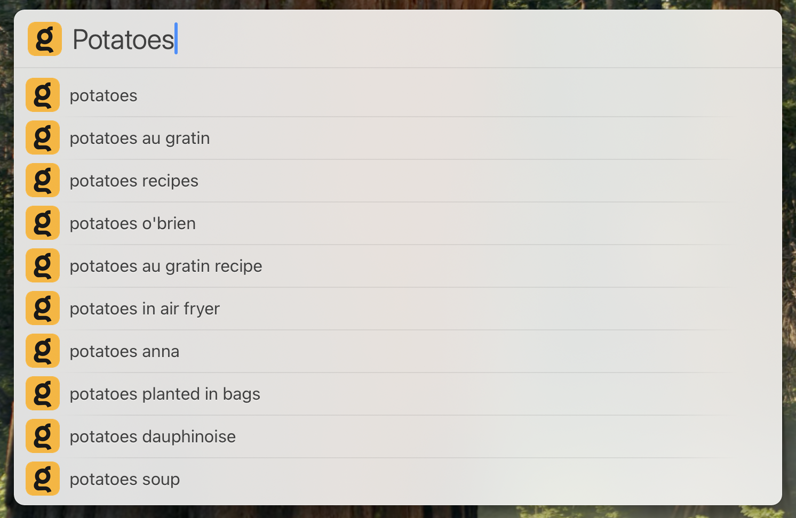

# Kagi Search with Suggestions for LaunchBar

Search Kagi with suggestions from [LaunchBar](https://www.obdev.at/products/launchbar/index.html).

## Installation.

### Easy

Download the latest version from Releases and double-click the `lbaction` file to install in LaunchBar. 

### Slightly Less Easy

1. Create a new folder at `'~/Library/Application Support/LaunchBar/Actions'` called `Kagi Search.lbaction`.
2. Clone this repository into that folder.

